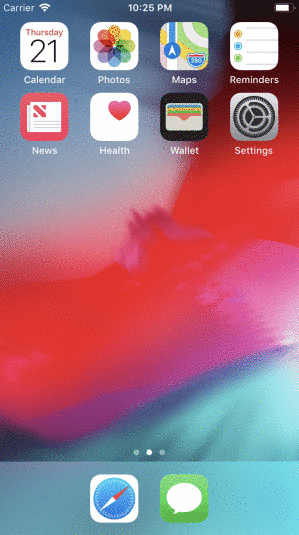

# Project 3 - **TweetReader**
***TweetReader** is a basic twitter app to view, compose, favorite, and retweet tweets.*
*Time spent: **20** hours spent in total*

# Twitter - Part II
## User Stories
The following **required** functionality is completed:

- [X] User can compose a tweet. (4pts)
- [X] User can favorite a tweet. (4pts)
- [X] User can retweet a tweet. (2pts)

## Twitter Part I
## User Stories
The following **required** functionality is completed:

- [X] User sees app icon in home screen and styled launch screen. (1pt)
- [X] User can log in. (1pt)
- [X] User can log out. (1pt)
- [X] User stays logged in across restarts. (1pt)
- [X] User can view tweets with the user profile picture, username, and tweet text. (6pts)

The following **bonus** features are implemented:
- [X] User can pull to refresh. (1pt)
- [X] User can load past tweets infinitely. (2pts)

## Video Walkthrough
Here's a walkthrough of implemented user stories:

